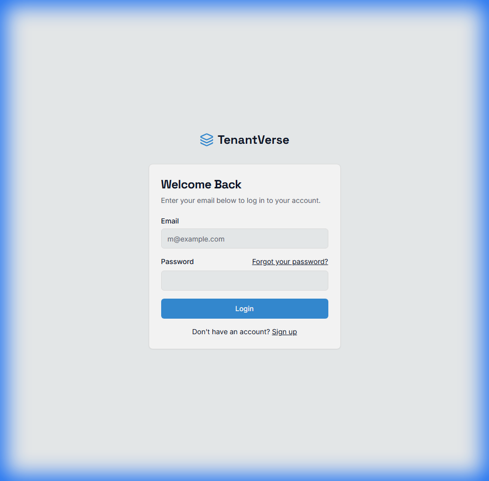
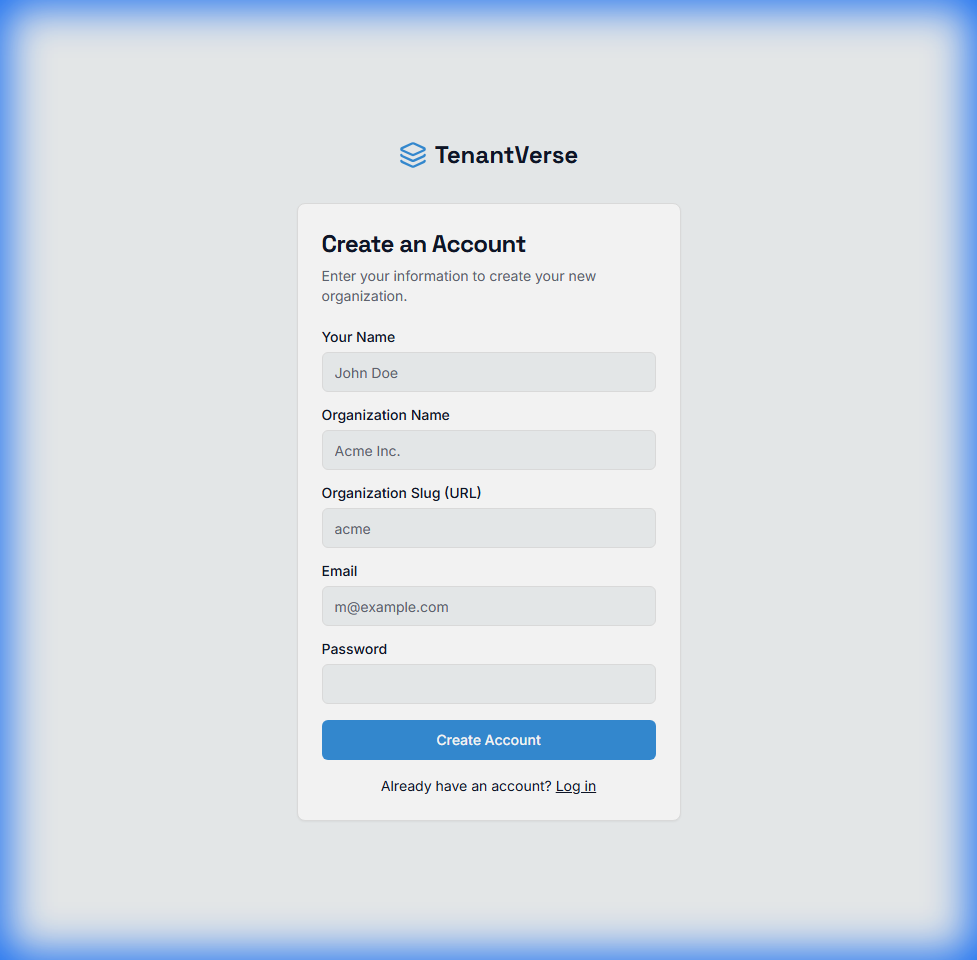

# TenantVerse - Property Management SaaS

[](https://github.com/unnita1235/TenantVerse)
[](https://tenant-verse-one.vercel.app)
[](https://tenantverse.onrender.com/api/health)
[](https://www.typescriptlang.org/)
[](LICENSE)

A full-stack property management platform built with modern web technologies. This project demonstrates real-world development with **Next.js 15**, **Express.js**, and **MongoDB**, featuring authentication, payment processing simulation, and containerization.

**Live Demo:** [tenant-verse-one.vercel.app](https://tenant-verse-one.vercel.app)

---

## 📋 Table of Contents

- [Honest Assessment](#honest-assessment)
- [Features](#features)
- [Tech Stack](#tech-stack)
- [Getting Started (Automated)](#getting-started-automated)
- [Manual Setup](#manual-setup)
- [Project Structure](#project-structure)
- [Deployment](#deployment)
- [API Documentation](#api-documentation)
- [Database Schema](#database-schema)
- [License](#license)

---

## Honest Assessment

TenantVerse is a **functional property management application** designed to showcase full-stack development capabilities.

**What it IS:**
*   ✅ **Modern Stack:** Built with the latest Next.js 15 (React 19) and strict TypeScript.
*   ✅ **Architected for Scale:** Separate frontend and backend services, container-ready.
*   ✅ **Secure:** JWT authentication with access/refresh token rotation.
*   ✅ **Production-Minded:** Includes CI/CD pipelines, environment configuration, and error handling.

**What it is NOT (Yet):**
*   ❌ **Enterprise SaaS:** It is not currently battling-tested for thousands of concurrent users.
*   ❌ **Fully Featured ERP:** It lacks advanced accounting, automated bank reconciliation, or legal compliance generation.
*   ❌ **Mobile Native:** It is a responsive web app, not a native iOS/Android application.

This project serves as a comprehensive portfolio piece demonstrating the ability to build, deploy, and maintain a complex web application.

---

## 📸 Screenshots

| Landing Page | Login Page |
|:---:|:---:|
|  |  |

| Signup Page |
|:---:|
|  |

---

## ✨ Features

### 1. Multi-Role Management
*   **Property Management:** Create and track properties with details and photos.
*   **Tenant Tracking:** Manage lease agreements, dates, and contact info.

### 2. Financials
*   **Rent Tracking:** Record statements and payment status.
*   **Stripe Integration:** Basic implementation for payment processing (demonstration mode).

### 3. Communication & Operations
*   **In-App Messaging:** Direct communication between landlords and tenants.
*   **Email Notifications:** Integrated via Nodemailer.

### 4. Security & Tech
*   **RBAC:** Role-Based Access Control (Admin vs. User).
*   **Data Integrity:** Mongoose schemas with strict validation.

---

## 🛠 Tech Stack

### Frontend
*   **Framework:** Next.js 15 (App Router)
*   **Language:** TypeScript 5.3+
*   **Styling:** Tailwind CSS, Shadcn/UI
*   **State:** React Context & Hooks

### Backend
*   **Runtime:** Node.js 20+
*   **Framework:** Express.js
*   **Database:** MongoDB Atlas
*   **Auth:** JWT (Access + Refresh Tokens)

### DevOps
*   **CI/CD:** GitHub Actions
*   **Containerization:** Docker & Docker Compose
*   **Hosting:** Vercel (Frontend), Render (Backend)

---

## 🚀 Getting Started (Automated)

We have included a PowerShell script to fully automate the local setup process (install, build, and run).

### Prerequisites
*   Node.js 18+ installed.
*   Git installed.
*   PowerShell (standard on Windows).

### Steps
1.  **Clone the repository:**
    ```bash
    git clone https://github.com/unnita1235/TenantVerse.git
    cd TenantVerse
    ```

2.  **Run the Automation Script:**
    ```powershell
    .\DEPLOYMENT_AUTOMATION.ps1
    ```
    *This script will automatically install dependencies for both frontend and backend, build them, and start the services.*

3.  **Access the App:**
    *   Frontend: `http://localhost:3000`
    *   Backend: `http://localhost:5000`

---

## ⚙️ Manual Setup

If you prefer to run things manually:

**1. Backend Setup**
```bash
cd backend
npm install
# Create .env file based on .env.example
npm run dev
```

**2. Frontend Setup**
```bash
cd frontend
npm install
# Create .env.local file
npm run dev
```

---

## 📁 Project Structure

```
TenantVerse/
├── DEPLOYMENT_AUTOMATION.ps1 # One-click setup script
├── frontend/                 # Next.js Application
│   ├── src/app/             # App Router Pages
│   ├── src/components/      # UI Components
│   └── ...
├── backend/                  # Express API
│   ├── src/controllers/     # Logic Layer
│   ├── src/models/          # DB Schemas
│   └── ...
└── ...
```

---

## 🌐 Deployment

### Frontend (Vercel)
Connect your GitHub repository to Vercel. The `next.config.ts` is configured for Vercel deployment.

### Backend (Render)
Connect your GitHub repository to Render.
*   **Build Command:** `npm install && npm run build`
*   **Start Command:** `npm start`

---

## 📄 License

This project is licensed under the MIT License - see the [LICENSE](LICENSE) file for details.

---

**Built by [Unnita](https://github.com/unnita1235)**
